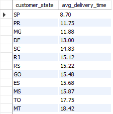
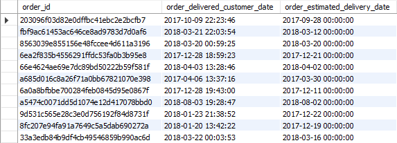
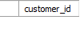
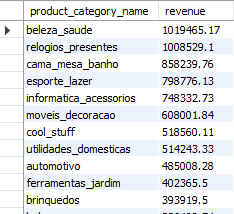
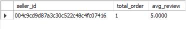

# SQL Food Delivery Analysis

## 📌 Project Overview

This project analyzes food delivery e-commerce data using **MySQL** to answer practical business questions related to delivery performance, customer retention, product revenue, and seller satisfaction.

The goal of this project is to use SQL to transform raw transactional data into meaningful business insights.

## 🎯 Business Problems

This project answers the following questions:

* Which orders were delivered later than the estimated delivery date?
* What is the average delivery time by state?
* What is the repeat purchase rate within 6 months?
* Which product categories generate the most revenue?
* Which sellers have the highest average review score?

## 🛠️ Tools & Technologies

* MySQL
* SQL
* CTEs
* Aggregate Functions
* JOINs
* Date Functions
* GROUP BY
* HAVING
* Subqueries
* GitHub

---

# 📊 SQL Analysis

## 1. Orders Delivered Later Than Estimated Date

### Business Question

Which orders were delivered later than the estimated delivery date?

### SQL Approach

The actual delivery date is compared with the estimated delivery date to identify delayed orders.

**[🔗 View Query](queries/1_avg_delivery_time.sql)**

### Output Screenshot



---

## 2. Average Delivery Time by State

### Business Question

What is the average delivery time for customers in each state?

### SQL Approach

Delivery time is calculated using the difference between the order purchase date and the actual customer delivery date. The average is then calculated for each state.

**[🔗 View Query](queries/2_delivered_later.sql)**

### Output Screenshot



---

## 3. Repeat Purchase Within 6 Months

### Business Question

What is the repeat purchase rate for customers within 6 months?

### SQL Approach

A CTE is used to identify each customer's first purchase. Customers who placed another order within six months of their first purchase are then identified.

> **Data Limitation:** The dataset does not contain a separate `unique_customer_id` field, so `customer_id` is used to identify customers.

**[🔗 View Query](queries/3_repeat_purchase_rate.sql)**

### Output Screenshot



---

## 4. Revenue by Product Category

### Business Question

Which product categories generate the most revenue?

### SQL Approach

Product and order-item tables are joined to calculate total revenue for each product category.

**[🔗 View Query](queries/4_categories_gen_revenue.sql)**

### Output Screenshot



---

## 5. Sellers with the Highest Average Review Score

### Business Question

Which sellers have the highest average review score?

### SQL Approach

Seller order data is joined with customer reviews. Sellers are grouped and their average review score is calculated.

A minimum threshold of more than 50 distinct orders is used to make the comparison more meaningful.

**[🔗 View Query](queries/5_highest_avg_review.sql)**

### Output Screenshot



---

# 📈 Key Business Areas Analyzed

| Area               | Analysis                         |
| ------------------ | -------------------------------- |
| Delivery           | Late deliveries                  |
| Logistics          | Average delivery time by state   |
| Customer Retention | Repeat purchases within 6 months |
| Revenue            | Revenue by product category      |
| Seller Performance | Average customer review score    |

---

# 🧠 SQL Concepts Demonstrated

* `SELECT`
* `WHERE`
* `JOIN`
* `GROUP BY`
* `HAVING`
* `ORDER BY`
* `LIMIT`
* `COUNT()`
* `COUNT(DISTINCT)`
* `SUM()`
* `AVG()`
* `ROUND()`
* `MIN()`
* `DATEDIFF()`
* `DATE_ADD()`
* Common Table Expressions (CTEs)
* Date-based analysis
* Business KPI analysis

---

# 📁 Project Structure

```text
sql-food-delivery-project/
│
├── README.md
│
├── queries/
│   ├── late_delivery_orders.sql
│   ├── average_delivery_time_by_state.sql
│   ├── repeat_purchase_6_months.sql
│   ├── revenue_by_product_category.sql
│   └── highest_avg_review_seller.sql
│
└── screenshots/
    ├── late_delivery_orders.png
    ├── average_delivery_time_by_state.png
    ├── repeat_purchase_6_months.png
    ├── revenue_by_product_category.png
    └── highest_avg_review_seller.png
```

---

# 💡 Conclusion

This project demonstrates how SQL can be used to solve real-world business problems in an e-commerce environment.

The analysis covers **delivery performance, customer retention, revenue generation, and seller satisfaction**, providing practical experience in writing SQL queries and interpreting business data.
